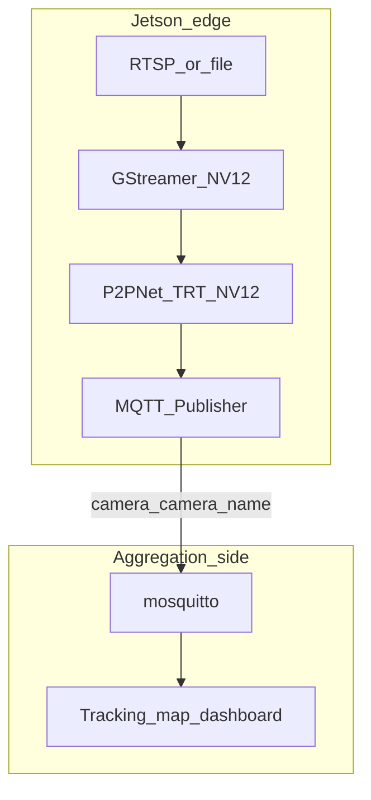
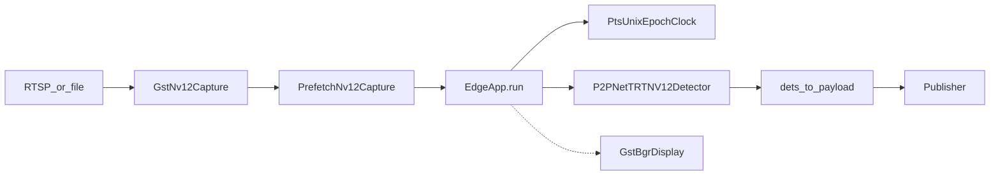

# パイプライン概要

Jetson AGX Orin 上のエッジアプリは、カメラ映像（または動画ファイル）から人物の点検出を行い、結果だけを MQTT で集約側へ送ります。追跡・マップ・ダッシュボードは集約側の責務です。

## システム境界

| 側 | やること | やらないこと |
|----|----------|--------------|
| エッジ | デコード、検出、MQTT 配信 | 追跡 ID 付与、マップ描画 |
| 集約 | 受信、追跡、可視化 | 本リポジトリのエッジループに含まれない |

## 本番データフロー

`prefetch: false` のときは `PrefetchNv12Capture` を挟まず、`GstNv12Capture` を直接 `pull` します。`display: false`（既定）のとき破線の表示経路は実質スキップされます。

## 1 フレームの処理順

エントリは `./run.sh` または `uv run python run.py --cfg pipeline_jetson/config/edge.yaml` です。YAML の `_target_` で `EdgeApp` が組み立てられ、`run()` がメインループになります。

実装: [`pipeline_jetson/edge_app.py`](../pipeline_jetson/edge_app.py) の `EdgeApp.run()`

| 順 | 処理 | 実装 | 入出力の要点 |
|----|------|------|--------------|
| 1 | フレーム取得 | `capture.pull()` | `(nv12, seq, pts)`。EOS で `None`、無応答は `PullTimeout` |
| 2 | 時刻変換 | `PtsUnixEpochClock.to_unix(pts)` | PTS 相対時刻 → Unix epoch（秒, float） |
| 3 | 検出 | `detector.infer(nv12)` | packed NV12 → `Nx3 (x, y, score)` |
| 4 | ペイロード化 | `dets_to_payload(dets)` | `{"point": [...], "bbox": []}` |
| 5 | MQTT 配信 | `publisher.publish_detections(...)` | トピック `camera/<camera_name>` |
| 6 | （任意）表示 | `nv12_to_bgr` → `draw_detections` → `display.push` | デバッグ用。本番は通常オフ |

起動時の開始順は capture →（display）→ publisher、終了時は逆順に近い形で display / capture / publisher を止めます。

## 設計原則

1. **検出に資源を集中** — MQTT には検出点のみ。追跡 ID は含めない。
2. **負荷時もフレームを捨てない** — appsink は `drop=false`。バッファ満杯時は上流がブロック（backpressure）する。意図的な間引きだけ `capture_fps`（PTS スキップ）で行う。
3. **前処理はエンジン内** — 本番は `--fuse-nv12` の TensorRT エンジン。Python 側は H2D と実行が中心。
4. **プリフェッチでコピーと推論を重ねる** — `PrefetchNv12Capture` が次フレームの host コピーをワーカースレッドで行い、`infer()` とオーバーラップさせる。
5. **解像度の契約** — `size`（W, H）≡ `detector.img_size`（H, W）≡ エンジン入力サイズ。不一致は起動時または推論時に失敗する。

## 主要モジュール対応表

| 役割 | パス | クラス / 関数 |
|------|------|----------------|
| エントリ | [`run.py`](../run.py) | `main` → `hydra.utils.instantiate` |
| 設定 | [`pipeline_jetson/config/edge.yaml`](../pipeline_jetson/config/edge.yaml) | `_target_: EdgeApp` |
| メインループ | [`pipeline_jetson/edge_app.py`](../pipeline_jetson/edge_app.py) | `EdgeApp` |
| キャプチャ / 表示 | [`pipeline_jetson/components/edge/gst_io.py`](../pipeline_jetson/components/edge/gst_io.py) | `GstNv12Capture`, `PrefetchNv12Capture`, `GstBgrDisplay` |
| 検出 | [`processor/detector/p2pnet_trt_nv12.py`](../processor/detector/p2pnet_trt_nv12.py) | `P2PNetTRTNV12Detector` |
| MQTT | [`pipeline_jetson/components/edge/publisher.py`](../pipeline_jetson/components/edge/publisher.py) | `Publisher` |
| エンジンビルド | [`trt_scripts/`](../trt_scripts/) | `export_p2pnet_onnx.py`, `build_p2pnet_engine.py` |

## 本番外のコード

次はエッジ本番ループに配線されていません。詳細ドキュメントの対象外です。

- `processor/tracker/`（ByteTrack 系）— 集約側向け
- `processor/detector/yolo26.py`、DEIMV2 重み — 未配線
- `P2PNetTRTDetector` / `P2PNetNV12Detector` / `P2PNetDetector` — 参照・ベンチ・別経路
- `pipeline_jetson/components/edge/timer.py` — `EdgeApp` から未使用
- `Publisher.publish_result` — 追跡済み objects 用のレガシー API

## 次に読む文書

工程ごとの詳細は [stages/](stages/) を順に参照してください。設定値の一覧は [reference/configuration.md](reference/configuration.md)、集約側との契約は [reference/mqtt_contract.md](reference/mqtt_contract.md) です。
